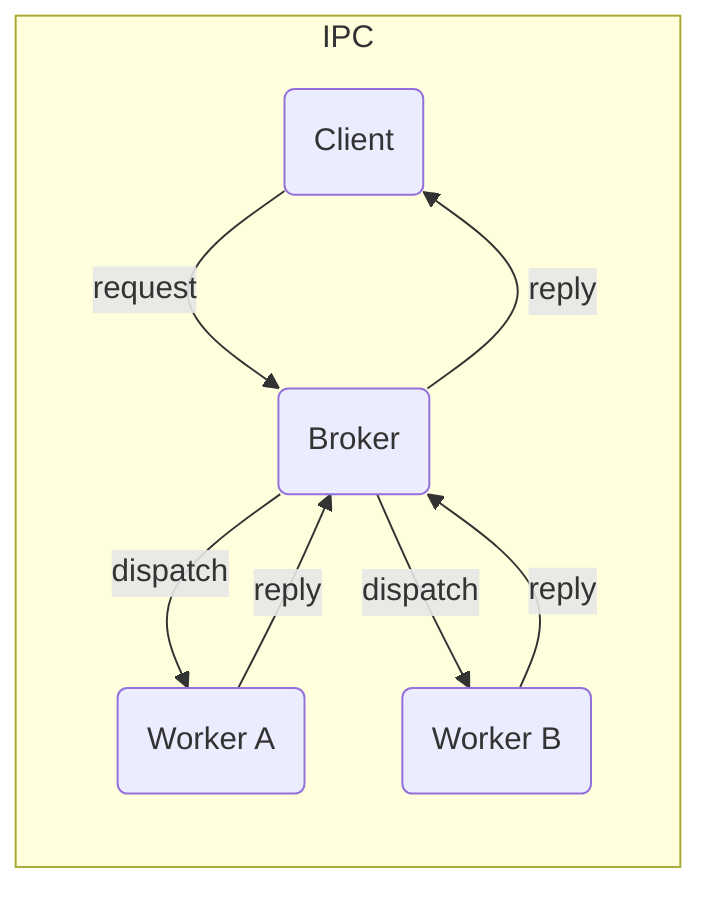

# IPC - Asynchronous Majordomo Broker

A **Python 3.10+** implementation of the Majordomo pattern¹ built on **ZeroMQ** and **MsgPack**. The codebase is organised into three lightweight packages:

| Package    | Purpose                                     | Import root  | Extras marker |
| ---------- | ------------------------------------------- | ------------ | ------------- |
| **Broker** | Routes messages between clients and workers | `ipc.broker` | -             |
| **Client** | Convenience wrapper around a REQ socket     | `ipc.client` | -             |
| **Worker** | Helper that exposes coroutines as services  | `ipc.worker` | `ipc[worker]` |

---

## Architecture overview



The broker is single‑process, asynchronous and **stateless** - after a restart, workers and clients automatically reconnect. Heartbeats monitor liveness, and unresponsive peers are removed after a timeout.

---

## Installation

```bash
pip install git+https://github.com/Overseer-Team/ipc

# optional worker deps (ie discord.py=*)
pip install git+https://github.com/Overseer-Team/ipc#egg=ipc[worker]
```

> **Note** The package is not published on PyPI. Installation is done purely via git.

---

## Running the broker

### Plain Python

```bash
python -m src.ipc.broker  # binds to tcp://127.0.0.1:5555 by default (not 0.0.0.0)
```

Environment variables:

| Variable      | Default     | Description                |
| ------------- | ----------- | -------------------------- |
| `BROKER_HOST` | `127.0.0.1` | Interface on which to bind |
| `BROKER_PORT` | `5555`      | TCP port                   |

The broker writes logs to stdout and a rotating log at `./logs/broker.log`.

### Docker Compose example

```yaml
services:
  broker:
    container_name: broker
    build: https://github.com/Overseer-Team/ipc.git
    restart: unless-stopped
    environment:
      - BROKER_HOST=0.0.0.0
      - BROKER_PORT=5555
```

---

## Client API example

```python
import asyncio
from ipc.client import MDClient

async def main() -> None:
    client = MDClient("127.0.0.1", 5555)
    result = await client.request("add", {"x": 6, "y": 7})
    print("Result:", result)  # → 42

asyncio.run(main())
```

The client automatically adds the required header, retries failed requests (`RETRIES = 3`) and handles time‑outs.

---

## Worker API example

```python
import asyncio
from ipc.worker import IPC, route

@route()
async def add(bot, data):
    return data["x"] + data["y"]

async def main() -> None:
    ipc = IPC(bot=None, broker_ip="127.0.0.1", broker_port=5555)
    await ipc.start()

asyncio.run(main())
```

Workers send heartbeats every `HEARTBEAT = 2500 ms` and reconnect automatically if the broker becomes unreachable.

---

## Wire format

```
[ <header: C_CLIENT | W_WORKER>
  <service: bytes>
  <payload: msgpack‑encoded> ]
```

Invalid frames raise `InvalidHeader`.


## Contributing

- Don't, unless you know what you're doing.


## Licence

This project is released under the MIT License.


¹ Majordomo Protocol, Pieter Hintjens.
